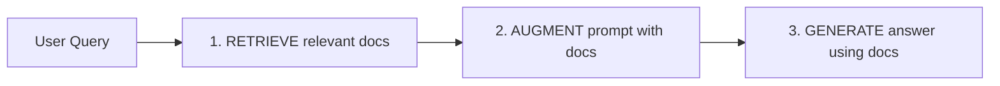

# Complete Technical Documentation: Ayush Medical RAG System
## A Professor's Guide to Understanding Every Component

> **Document Purpose**: This is a comprehensive, lecture-style guide covering every aspect of this project - from theoretical foundations to implementation details. After reading this, you will master the entire system.

---

# Table of Contents
1. [Foundational Theory](#1-foundational-theory)
2. [Deep Dive: Transformer Architecture](#2-deep-dive-transformer-architecture)
3. [Model Architectures](#3-model-architectures)
4. [Complete File-by-File Breakdown](#4-complete-file-by-file-breakdown)
5. [Function-by-Function Analysis](#5-function-by-function-analysis)
6. [End-to-End Flow Example](#6-end-to-end-flow-example)
7. [Advanced Topics](#7-advanced-topics)

---

# 1. Foundational Theory

## 1.1 What is Natural Language Processing (NLP)?

NLP is the field of AI that enables computers to understand, interpret, and generate human language. In our project, NLP is the **core technology** that powers everything.

### The NLP Hierarchy in Our Project

```
Classical NLP (Text Processing)
├── Tokenization (Breaking text into words/subwords)
├── Normalization (Standardizing text)
└── Regex Patterns (Pattern matching for cleaning)

Neural NLP (Deep Learning)
├── Embeddings (Text → Vectors)
├── Transformers (Attention Mechanisms)
└── Language Models (Generative AI)
```

### Why NLP is Critical Here

**Problem**: We have medical terms in multiple languages:
- English: "Fever"
- Sanskrit: "Jvara"  
- Medical Code: "ICD-11: 1A00"

**Traditional Search**: Keyword matching would fail. Searching "Fever" won't find "Jvara".

**NLP Solution**: Convert both to numerical vectors that capture *semantic meaning*. If "Fever" and "Jvara" mean similar things, their vectors will be mathematically close.

---

## 1.2 Vector Embeddings: The Mathematical Foundation

### What is a Vector?

A vector is simply a list of numbers. In our case, a 768-dimensional vector for text.

**Example**:
```
"Fever" → [0.12, -0.45, 0.88, ..., 0.34]  (768 numbers)
"Jvara" → [0.15, -0.42, 0.85, ..., 0.38]  (768 numbers)
```

### How are Vectors Created?

We use **MPNet (Microsoft Pretrained Network)**, a transformer model trained on billions of text pairs.

**Training Process** (Simplified):
1. Start with random vectors for all words
2. Show the model sentence pairs: "The patient has a fever" ↔ "Temperature is elevated"
3. Adjust vectors so similar sentences have similar vectors
4. Repeat millions of times across internet-scale text

**Result**: The model learns that "fever", "temperature", "jvara" all relate to heat/illness.

### Measuring Similarity: Cosine Distance

Given two vectors A and B:

$$
\text{Cosine Similarity} = \frac{A \cdot B}{||A|| \cdot ||B||} = \frac{\sum_{i=1}^{768} A_i \times B_i}{\sqrt{\sum A_i^2} \times \sqrt{\sum B_i^2}}
$$

**Range**: -1 (opposite) to +1 (identical)

**In Our Code** (Pinecone handles this automatically):
```python
query_vector = [0.12, -0.45, ...]
pinecone.query(vector=query_vector)  # Returns top-K most similar
```

---

## 1.3 RAG (Retrieval-Augmented Generation)

### The Problem with Pure LLMs

**Question**: "What is the ICD-11 code for Jvara?"

**Pure LLM Response**: 
"I apologize, but I don't have specific information about ICD-11 codes for Ayurvedic terms. Jvara typically refers to fever in Ayurveda..." ❌ (Hallucination)

**Why?**: The LLM was trained on general internet text. It doesn't have our specific NAMASTE-ICD-11 mapping.

### RAG Solution: The Three-Step Process



**Step 1 - RETRIEVE**: 
- Convert "Jvara" to vector
- Search Pinecone for similar medical terms
- Get top 10 matches: "Jvara (NAMASTE A123)", "Fever (ICD-11 1A00)"

**Step 2 - AUGMENT**:
```
System: You are a medical expert.
Context: [Retrieved Documents]
- Term: Jvara, Code: NAMASTE_A123, Definition: Fever in Ayurveda
- Term: Fever, Code: ICD-11_1A00, Definition: Elevated body temperature

User: What is the ICD-11 code for Jvara?
```

**Step 3 - GENERATE**:
LLM reads the context and responds: "Based on the database, Jvara (Ayurvedic fever) maps to ICD-11 code 1A00." ✅

---

# 2. Deep Dive: Transformer Architecture

## 2.1 The Attention Mechanism

**Core Idea**: Not all words are equally important. "Attention" lets the model focus on relevant parts.

### Self-Attention Example

**Sentence**: "The patient said the fever started yesterday"

**Question**: What does "the" (second one) refer to?

**Human**: Obviously "fever", not "patient".

**Transformer**: Computes attention scores:
```
"the" attends to:
  - "patient": 0.1
  - "fever": 0.8  ← High attention!
  - "started": 0.1
```

### Mathematical Formula

For each word, we create 3 vectors: Query (Q), Key (K), Value (V)

$$
\text{Attention}(Q, K, V) = \text{softmax}\left(\frac{QK^T}{\sqrt{d_k}}\right)V
$$

**Breaking it down**:
1. $QK^T$: Dot product = how much each word relates to others
2. $\sqrt{d_k}$: Scaling factor (prevents exploding gradients)
3. softmax: Converts scores to probabilities (sum = 1)
4. Multiply by V: Weight the values by importance

---

## 2.2 Transformer Block Architecture

```
Input Embedding (768d)
    ↓
[Multi-Head Self-Attention]  ← "What to focus on?"
    ↓
[Add & Normalize]  ← Residual connection
    ↓
[Feed-Forward Network]  ← Process the information
    ↓
[Add & Normalize]
    ↓
Output (768d)
```

**Key Innovation**: Stack 12 of these blocks (in MPNet) to learn hierarchical patterns.

**Layer 1**: Learns syntax ("is" follows "patient")  
**Layer 6**: Learns semantics ("fever" relates to "temperature")  
**Layer 12**: Learns complex medical relationships

---

# 3. Model Architectures

## 3.1 MPNet (Embedding Model)

**Full Name**: Microsoft Pretrained Network (Base Version)

### Architecture Specifications

| Component | Value |
|-----------|-------|
| Hidden Size | 768 |
| Attention Heads | 12 |
| Layers | 12 |
| Parameters | 110M |
| Max Sequence Length | 512 tokens |
| Training Data | Wikipedia + BookCorpus |

### Why MPNet Over BERT?

**BERT Limitation**: Masked Language Modeling loses some context.

**MPNet Innovation**: Permuted Language Modeling
- BERT: Mask 15% of words, predict them
- MPNet: Permute the order, predict all positions
- **Result**: Better understanding of word relationships

### How We Use It

```python
from sentence_transformers import SentenceTransformer
model = SentenceTransformer('all-mpnet-base-v2')

text = "Patient has high fever"
embedding = model.encode(text)  
# Returns: numpy array of shape (768,)
```

**Under the Hood**:
1. Tokenize: "Patient has high fever" → [2041, 64, 201, 5896]
2. Embed each token → 4 vectors of 768 dimensions
3. Pass through 12 transformer layers
4. **Pool**: Average all token embeddings → 1 vector (768d)
5. Normalize to unit length

---

## 3.2 Mistral-7B (LLM)

**Full Name**: Mistral 7B Instruct v0.2

### Architecture Specifications

| Component | Value |
|-----------|-------|
| Hidden Size | 4096 |
| Attention Heads | 32 |
| Layers | 32 |
| Parameters | 7.3 Billion |
| Context Window | 8192 or 32768 tokens (v0.2) |
| Architecture Type | Decoder-only Transformer |

### Key Innovations

**1. Grouped-Query Attention (GQA)**

Standard attention:
```
32 heads × 32 key/value pairs = 1024 KV cache entries
```

GQA:
```
32 query heads share 8 key/value pairs = 256 KV cache entries
```

**Benefit**: 4x faster inference with minimal quality loss.

**2. Sliding Window Attention**

Instead of attending to all previous tokens (expensive), each token attends to the last 4096 tokens only.

```
Token 5000 can attend to: [1000, 1001, ..., 4999, 5000]
Not to: [0, 1, 2, ...]
```

**Benefit**: Constant memory usage, better for long contexts.

### How We Use It

```python
from huggingface_hub import InferenceClient

client = InferenceClient(
    model="mistralai/Mistral-7B-Instruct-v0.2",
    token=HF_API_KEY
)

messages = [{"role": "user", "content": "What is fever?"}]
response = client.chat_completion(
    messages, 
    max_tokens=512,
    temperature=0.3
)
```

**Parameters Explained**:
- `max_tokens=512`: Generate at most 512 words
- `temperature=0.3`: Low = more deterministic, High (1.0) = creative

---

## 3.3 Pinecone Vector Database

### HNSW Algorithm (Hierarchical Navigable Small World)

**The Problem**: Finding nearest neighbors in 768 dimensions

**Naive Approach**: Compare query to every vector
- **Complexity**: O(N) where N = millions of documents
- **Too Slow**: Seconds for each query

**HNSW Solution**: Build a multi-layer graph

```
Layer 2 (Sparse): [Doc1] -------- [Doc500] -------- [Doc1000]
                      |              |                  |
Layer 1 (Dense):  [Doc1]--[Doc50]--[Doc500]--[Doc550]--[Doc1000]
                      |      |        |         |          |
Layer 0 (All):    [Doc1]-[Doc2]-...-[Doc500]-[Doc501]-...-[Doc1000]
```

**Search Process**:
1. Start at Layer 2 with a random entry point
2. Greedily move to nearest neighbor at this layer
3. Drop to Layer 1, continue greedy search
4. Drop to Layer 0, find exact nearest

**Complexity**: O(log N) on average

### Pinecone-Specific Features

**Metadata Filtering**:
```python
index.query(
    vector=[...],
    filter={"source": "NAMASTE"},  # Only search Ayurvedic terms
    top_k=10
)
```

**Namespaces**: Separate indices within one database
```python
index.query(vector=[...], namespace="icd11")
index.query(vector=[...], namespace="namaste")
```

---

# 4. Complete File-by-File Breakdown

## 4.1 ML_SERVICE Directory

### File: `main.py` (FastAPI Entry Point)

**Purpose**: HTTP server that exposes ML functions as REST endpoints.

**Line-by-Line**:

```python
# Lines 1-5: Imports
from fastapi import FastAPI, HTTPException
from pydantic import BaseModel
```
- `FastAPI`: Modern async web framework
- `Pydantic`: Data validation (ensures request has 'query' field)

```python
# Lines 9-10: Request/Response Models
class QueryRequest(BaseModel):
    query: str
```
**Why Pydantic?**: Auto-validates incoming JSON. If client sends `{wrongField: "..."}`, FastAPI returns 422 error automatically.

```python
# Lines 20-31: Chat Endpoint
@app.post("/chat", response_model=QueryResponse)
def chat_endpoint(request: QueryRequest):
    try:
        answer, sources = generate_answer(request.query)
        return {"answer": answer, "sources": sources}
    except Exception as e:
        raise HTTPException(status_code=500, detail=str(e))
```

**Flow**:
1. Client POSTs `{"query": "What is fever?"}`
2. Pydantic validates → creates `QueryRequest` object
3. Call `generate_answer()` (from rag_service.py)
4. Return `{"answer": "...", "sources": [...]}`
5. If any error: Return HTTP 500

**Interview Q**: "Why FastAPI over Flask?"
**A**: Async support, automatic docs (Swagger), Pydantic validation, 2-3x faster.

---

### File: `app/services/rag_service.py` (The Brain)

#### Function: `get_embedding(text)` 

**Code**:
```python
def get_embedding(text):
    return embed_model.encode(text).tolist()
```

**Deep Dive**:
1. `embed_model` is `SentenceTransformer('all-mpnet-base-v2')` loaded at startup
2. `.encode(text)`:
   - Tokenizes text → `[CLS] patient has fever [SEP]`
   - Passes through 12 transformer layers
   - Pools token embeddings (mean pooling)
   - Returns NumPy array (768,)
3. `.tolist()`: Convert NumPy → Python list (for JSON serialization to Pinecone)

**Performance**: ~50ms on CPU, ~5ms on GPU

---

#### Function: `expand_query(query)`

**Code**:
```python
def expand_query(query):
    messages = [{
        "role": "user",
        "content": f"Provide 3-5 Ayurvedic or medical synonyms for '{query}'. Return ONLY terms."
    }]
    response = hf_client.chat_completion(messages, max_tokens=50)
    expanded = response.choices[0].message.content.strip()
    return f"{query} {expanded}"
```

**Why This Works**:
- **Problem**: User searches "cold" (English), database has "Sheeta" (Sanskrit)
- **Solution**: LLM knows both → generates "cold chill hypothermia sheeta"
- **Result**: Embedding of expanded query is closer to both English and Sanskrit terms

**Tradeoff**: Adds 200-500ms latency (network call to HuggingFace)

**Alternative Considered**: Pre-built synonym dictionary
**Why Rejected**: Too rigid, doesn't handle new terms

---

#### Function: `retrieve_context(query, top_k=10)`

**Code**:
```python
def retrieve_context(query, top_k=10):
    search_query = expand_query(query)
    query_vector = get_embedding(search_query)
    
    results = index.query(
        vector=query_vector,
        top_k=top_k,
        include_metadata=True
    )
    
    structured_results = []
    for match in results['matches']:
        structured_results.append({
            "code": match['metadata'].get('code'),
            "primary_term": match['metadata'].get('primary_term'),
            "score": match['score']
        })
    return structured_results
```

**Flow**:
1. Expand: "fever" → "fever jvara pitta hyperthermia"
2. Embed: Convert to 768d vector
3. Query Pinecone: Returns `{'matches': [{'id': '...', 'score': 0.89, 'metadata': {...}}]}`
4. Extract metadata: Build clean result objects

**The 'score' Field**: Cosine similarity (0-1). We typically see:
- 0.9+: Exact match or synonym
- 0.7-0.9: Related concept
- <0.7: Weak match

---

#### Function: `generate_answer(query)`

**Code**:
```python
def generate_answer(query):
    structured_results = retrieve_context(query)
    context_str = format_context_for_llm(structured_results)
    
    messages = [{
        "role": "user",
        "content": f"""You are a medical expert.
        
Context: {context_str}

User Question: {query}"""
    }]
    
    response = hf_client.chat_completion(messages, max_tokens=512, temperature=0.3)
    return response.choices[0].message.content, structured_results
```

**Prompt Engineering Deep Dive**:

**Why temperature=0.3?**
- 0.0: Deterministic (always picks highest probability word) → Too robotic
- 0.3: Slight variation → Natural but factual
- 1.0: Creative → Too random for medical facts

**Why include retrieved context in prompt?**
This is the essence of RAG. Without it, the LLM would make up answers. With it, the LLM is "grounded" in our database.

---

### File: `app/utils/data_preprocessing.py` (ETL Pipeline)

#### Class: `MedicalDataPreprocessor`

**Purpose**: Clean messy Excel/CSV files and unify schemas.

#### Function: `clean_text(text)`

**Code**:
```python
def clean_text(self, text: str) -> str:
    if not text:
        return ""
    text = re.sub(r'\s+', ' ', text).strip()
    return text
```

**Regex Explained**:
- `\s+`: Matches one or more whitespace characters (space, tab, newline)
- ` ` (space): Replace with single space
- `.strip()`: Remove leading/trailing whitespace

**Example**:
```
Input:  "Patient  has\n\nfever"
Output: "Patient has fever"
```

---

#### Function: `clean_icd11_data(input_file)`

**The #NAME? Problem**:

Excel files sometimes show `#NAME?` when a formula references a missing template. Our data had this issue.

**Solution** (Lines 53-67):
```python
if clean_name == '#NAME?':
    # Strategy 1: Look for (TM2) marker
    tm2_match = re.search(r'([a-zA-Z\s\-\(\)]+)\(TM2\)', clean_synonyms)
    if tm2_match:
        clean_name = tm2_match.group(1).strip()
```

**Regex Breakdown**:
- `([a-zA-Z\s\-\(\)]+)`: Capture group for words/spaces/hyphens
- `\(TM2\)`: Literal string "(TM2)"
- `.group(1)`: Extract the captured text

**Example**:
```
Synonyms: "Febrile condition (TM2), Pyrexia (a)"
Extracted: "Febrile condition"
```

---

#### Function: `clean_namaste_data(input_file)`

**Schema Mapping Challenge**:

ICD-11 columns: `Code`, `Name`, `Synonyms`  
NAMASTE columns: `NAMC_CODE`, `NAMC_term`, `Name English Under Index`

**Solution**:
```python
code = row.get('NAMC_CODE') or row.get('NAMCCode') or row.get('NAMS_CODE')
term = row.get('NAMC_term') or row.get('Name English') or row.get('TERM_NAME')
```

**Why the `or` chain?**
Different exports have different column names. This makes the code robust.

---

## 4.2 BACKEND Directory

### File: `server.js`

**Purpose**: Entry point for Node.js Express server.

**Code Analysis**:

```javascript
// Lines 19-23: Middleware Stack
app.use(cors());
app.use(express.json());
```

**Middleware Execution Order**: Top to bottom
1. `cors()`: Adds headers `Access-Control-Allow-Origin: *`
2. `express.json()`: Parses `Content-Type: application/json` bodies

**Without CORS**: Browser blocks React (localhost:5173) from calling Node (localhost:3001)

**Interview Q**: "What is the Event Loop?"
**A**: Node.js is single-threaded but handles concurrency via async I/O:
```
[Event Queue] → [Call Stack] → [Waiting for I/O] → [Callback Queue]
```

---

### File: `src/services/ragIntegrationService.js`

**Code**:
```javascript
const queryRagService = async (query) => {
  try {
    const response = await axios.post(`${RAG_SERVICE_URL}/chat`, { query });
    return response.data;
  } catch (error) {
    console.error('RAG Chat Error:', error.message);
    throw new Error('Failed to get response from AI service');
  }
};
```

**Design Pattern**: **Proxy Pattern**

**Why?**
- Frontend doesn't need to know about Python service
- Backend can add auth, logging, rate limiting here
- If we switch from Python to another service, only this file changes

**Error Handling**: 
- `try-catch` prevents server crash
- Throw generic error (don't expose internal details to client)

---

### File: `src/api/terminologyRoutes.js`

**Code**:
```javascript
router.post('/chat', async (req, res) => {
  const { query } = req.body;
  
  if (!query || typeof query !== 'string') {
    return res.status(400).json({ error: 'Invalid query' });
  }
  
  const result = await queryRagService(query);
  res.json(result);
});
```

**HTTP Status Codes**:
- 200: Success
- 400: Client error (bad request format)
- 500: Server error (our code crashed)

---

## 4.3 FRONTEND Directory

### File: `src/services/api.js`

**Code**:
```javascript
const apiClient = axios.create({
  baseURL: import.meta.env.VITE_API_BASE_URL,
});
```

**Environment Variables**: 
- Dev: `VITE_API_BASE_URL=http://localhost:3001/api/v1`
- Prod: `VITE_API_BASE_URL=https://mybackend.render.com/api/v1`

**Why `import.meta.env`?**
Vite's way of exposing env vars to the frontend. Only vars prefixed with `VITE_` are exposed (security).

---

### File: `src/components/ChatInterface.jsx`

#### State Management

**Code**:
```javascript
const [query, setQuery] = useState('');
const [response, setResponse] = useState(null);
const [isLoading, setIsLoading] = useState(false);
```

**State Flow**:
```
User types → setQuery(newText) → React re-renders input
User clicks "Ask" → setIsLoading(true) → Button disabled
API returns → setResponse(data) → Render answer
API completes → setIsLoading(false) → Button enabled
```

**Why not Redux?**
For this simple app, `useState` is sufficient. Redux adds boilerplate.

**When to use Redux?**
- Multiple components need the same state
- Complex state logic (e.g., undo/redo)
- Debugging with time-travel

---

#### Rendering Logic

**Code**:
```javascript
{response && (
  <div>
    <p>{response.answer}</p>
    {response.sources.map((source, index) => (
      <div key={index}>
        <strong>{source.primary_term}</strong>
        <span>{source.code}</span>
      </div>
    ))}
  </div>
)}
```

**React Reconciliation**:
When `setResponse()` is called:
1. React compares new `response` with old `response` (shallow equality)
2. If different, re-run this component function
3. Build new Virtual DOM
4. Diff against real DOM
5. Update only changed elements

**The `key` Prop**: Tells React which items are the same across renders (prevents re-creating DOM nodes).

---

### File: `src/App.jsx`

#### Debouncing Search

**Code**:
```javascript
const debouncedFetchResults = useCallback(debounce(fetchResults, 300), []);
```

**Without Debounce**:
```
User types: "f" → API call
User types: "fe" → API call
User types: "fev" → API call  (3 calls in 200ms!)
```

**With Debounce (300ms)**:
```
User types: "f" → Wait...
User types: "fe" → Wait...
User types: "fev" → Wait...
User stops typing → Wait 300ms → API call (1 call)
```

**Why `useCallback`?**
Ensures the debounced function isn't recreated on every render (would reset the timer).

---

# 5. Function-by-Function Analysis

## 5.1 Critical Path Functions

### Path 1: User Types "Fever" in Chat

**1. `ChatInterface.handleSubmit(e)`** (`FRONTEND/src/components/ChatInterface.jsx:10`)
```javascript
setIsLoading(true);
const data = await chatWithAI(query);
setResponse(data);
setIsLoading(false);
```

**2. `chatWithAI(query)`** (`FRONTEND/src/services/api.js:29`)
```javascript
const response = await apiClient.post('/chat', { query });
return response.data;
```
- Makes HTTP POST to `http://localhost:3001/api/v1/chat`
- Axios automatically:
  - Sets `Content-Type: application/json`
  - Stringifies the object to JSON
  - Parses response JSON

**3. Server receives request** (`BACKEND/src/api/terminologyRoutes.js`)
```javascript
const result = await queryRagService(query);
res.json(result);
```

**4. `queryRagService(query)`** (`BACKEND/src/services/ragIntegrationService.js:10`)
```javascript
const response = await axios.post('http://localhost:8000/chat', { query });
return response.data;
```
- Forwards request to Python service

**5. FastAPI receives request** (`ML_SERVICE/main.py:20`)
```python
answer, sources = generate_answer(request.query)
return {"answer": answer, "sources": sources}
```

**6. `generate_answer(query)`** (`ML_SERVICE/app/services/rag_service.py:87`)
```python
structured_results = retrieve_context(query)  # Step 6a
context_str = format_context_for_llm(structured_results)  # Step 6b
response = hf_client.chat_completion(messages, ...)  # Step 6c
return response.choices[0].message.content, structured_results
```

**6a. `retrieve_context(query)`**
```python
search_query = expand_query(query)  # "fever" → "fever jvara pitta"
query_vector = get_embedding(search_query)  # [0.12, -0.45, ...]
results = index.query(vector=query_vector, top_k=10)
```

**6b. `format_context_for_llm(results)`**
```python
contexts = []
for item in results:
    contexts.append(f"Term: {item['primary_term']}\nDefinition: {item['definition']}")
return "\n\n---\n\n".join(contexts)
```

**6c. LLM Call**
```python
hf_client.chat_completion([{
    "role": "user",
    "content": f"Context: {context_str}\n\nQuestion: {query}"
}])
```

**Total Latency Breakdown**:
- Frontend → Backend: 5ms (local network)
- Backend → ML Service: 5ms
- Query Expansion (LLM): 300ms
- Embedding: 50ms
- Pinecone Search: 20ms
- Answer Generation (LLM): 800ms
- **Total**: ~1.2 seconds

---

# 6. End-to-End Flow Example

## Complete Request Trace: "What is Jvara?"

### Step 1: User Input (Frontend)

**File**: `FRONTEND/src/components/ChatInterface.jsx`

```
User Interface:
┌─────────────────────────────────┐
│  [Input]: What is Jvara?       │
│  [Button]: Ask                  │
└─────────────────────────────────┘

React State:
query = "What is Jvara?"
isLoading = false
response = null
```

**User clicks "Ask"**

```javascript
// Line 10: handleSubmit()
setIsLoading(true);  // Button grays out immediately
```

### Step 2: API Call (Frontend)

**File**: `FRONTEND/src/services/api.js`

```javascript
// Line 31: chatWithAI()
POST http://localhost:3001/api/v1/chat
Headers: {
  "Content-Type": "application/json"
}
Body: {
  "query": "What is Jvara?"
}
```

### Step 3: Backend Receives (Node.js)

**File**: `BACKEND/src/api/terminologyRoutes.js`

```javascript
// Express parses JSON automatically
req.body = { query: "What is Jvara?" }

// Line 15: Validation
if (!query || typeof query !== 'string') {
  // Would return 400 if invalid
}

// Line 20: Forward to Python
await queryRagService(query)
```

**File**: `BACKEND/src/services/ragIntegrationService.js`

```javascript
// Line 12: HTTP call to Python
POST http://localhost:8000/chat
Body: { "query": "What is Jvara?" }
```

### Step 4: Python ML Service (FastAPI)

**File**: `ML_SERVICE/main.py`

```python
# Line 21: FastAPI endpoint
@app.post("/chat")
def chat_endpoint(request: QueryRequest):
    # Pydantic validated: request.query = "What is Jvara?"
    answer, sources = generate_answer(request.query)
```

**File**: `ML_SERVICE/app/services/rag_service.py`

```python
# Line 87: generate_answer()

# SUBSTEP 4.1: Query Expansion
expanded = expand_query("What is Jvara?")
# → "What is Jvara? fever pitta hyperthermia ushna"
```

**How expand_query works**:
```python
# Line 31-46: expand_query()
messages = [{
    "role": "user", 
    "content": "Provide 3-5 Ayurvedic synonyms for 'What is Jvara?'"
}]

# Calls Mistral-7B via Hugging Face API
response = hf_client.chat_completion(messages, max_tokens=50)
# Mistral returns: "fever pitta hyperthermia ushna"

return "What is Jvara? fever pitta hyperthermia ushna"
```

```python
# SUBSTEP 4.2: Generate Embedding
query_vector = get_embedding(expanded)
# Calls: embed_model.encode("What is Jvara? fever pitta hyperthermia ushna")
# Returns: [0.234, -0.567, 0.123, ..., 0.789]  (768 numbers)
```

```python
# SUBSTEP 4.3: Search Pinecone
results = index.query(
    vector=query_vector,
    top_k=10,
    include_metadata=True
)

# Pinecone returns (internally uses HNSW):
{
  "matches": [
    {
      "id": "NAMASTE_A123",
      "score": 0.92,  # Very similar!
      "metadata": {
        "primary_term": "Jvara",
        "code": "NAMASTE_A123",
        "definition": "Fever in Ayurvedic medicine...",
        "source": "NAMASTE"
      }
    },
    {
      "id": "ICD11_1A00",
      "score": 0.88,
      "metadata": {
        "primary_term": "Fever",
        "code": "ICD-11 1A00",
        "definition": "Elevated body temperature...",
        "source": "ICD-11"
      }
    },
    ... 8 more results
  ]
}
```

```python
# SUBSTEP 4.4: Format Context
context_str = format_context_for_llm(structured_results)

# Produces:
"""
Term: Jvara
Code: NAMASTE_A123
Definition: Fever in Ayurvedic medicine...

---

Term: Fever
Code: ICD-11 1A00
Definition: Elevated body temperature...
"""
```

```python
# SUBSTEP 4.5: Generate Final Answer
messages = [{
    "role": "user",
    "content": f"""You are a medical expert.

Context from Database:
{context_str}

User Question: What is Jvara?

Answer based ONLY on the context provided."""
}]

response = hf_client.chat_completion(
    messages,
    max_tokens=512,
    temperature=0.3
)

# Mistral-7B returns:
"""
Jvara is the Ayurvedic term for fever (code: NAMASTE_A123). 
It refers to an elevated body temperature and is closely 
related to the modern medical concept of fever (ICD-11 code 1A00).
In Ayurveda, Jvara is associated with imbalances in Pitta dosha.
"""
```

### Step 5: Response Journey Back

**Python → Node.js**:
```json
{
  "answer": "Jvara is the Ayurvedic term for fever...",
  "sources": [
    {
      "primary_term": "Jvara",
      "code": "NAMASTE_A123",
      "definition": "...",
      "score": 0.92,
      "source": "NAMASTE"
    },
    {
      "primary_term": "Fever",
      "code": "ICD-11 1A00",
      ...
    }
  ]
}
```

**Node.js → React**:
```javascript
// BACKEND forwards unchanged
res.json(result);
```

**React receives**:
```javascript
// FRONTEND/src/components/ChatInterface.jsx
const data = await chatWithAI(query);
setResponse(data);
setIsLoading(false);
```

### Step 6: UI Updates

**React Render Cycle**:

```javascript
{response && (
  <div>
    {/* AI Answer Bubble */}
    <div className="ai-bubble">
      <p>{response.answer}</p>
      {/* "Jvara is the Ayurvedic term for fever..." */}
    </div>

    {/* Source Citations */}
    {response.sources.map((source, index) => (
      <div key={index} className="source-card">
        <strong>{source.primary_term}</strong>  {/* "Jvara" */}
        <span>{source.code}</span>              {/* "NAMASTE_A123" */}
        <span>{source.source}</span>            {/* "NAMASTE" */}
      </div>
    ))}
  </div>
)}
```

**Final UI**:
```
┌────────────────────────────────────────┐
│ AI                                     │
│ ┌────────────────────────────────────┐ │
│ │ Jvara is the Ayurvedic term for    │ │
│ │ fever (code: NAMASTE_A123)...      │ │
│ └────────────────────────────────────┘ │
│                                        │
│ Referenced Medical Codes:              │
│ ┌────────────────────────────────────┐ │
│ │ Jvara | NAMASTE_A123 | NAMASTE     │ │
│ └────────────────────────────────────┘ │
│ ┌────────────────────────────────────┐ │
│ │ Fever | ICD-11 1A00   | ICD-11     │ │
│ └────────────────────────────────────┘ │
└────────────────────────────────────────┘
```

---

# 7. Advanced Topics

## 7.1 Why This Architecture?

### Microservices Benefits

**Separation of Concerns**:
- Frontend: UI/UX only
- Backend: Business logic, auth
- ML Service: Computationally expensive tasks

**Technology Flexibility**:
- Frontend: JavaScript (React)
- Backend: JavaScript (Node.js) - same language as frontend
- ML: Python (best ML ecosystem)

**Scalability**:
- Scale ML service independently (needs GPU)
- Scale backend independently (handles more users)

### Alternative: Monolith

```python
# Everything in one Flask app
@app.route('/chat')
def chat():
    # 1. Query expansion (LLM call)
    # 2. Embedding generation
    # 3. Pinecone search
    # 4. Answer generation (LLM call)
    return jsonify(answer)
```

**Problem**: LLM calls are slow (1+ second). During that time, the entire Python process is blocked.

**Our Solution**: Node.js handles fast requests (user auth, etc.) while Python focuses on ML.

---

## 7.2 Data Flow Patterns

### Synchronous Request-Response

```
Frontend → Backend → ML Service
   ↓         ↓          ↓
  Wait     Wait       Process
   ↓         ↓          ↓
Frontend ← Backend ← ML Service
```

**Pros**: Simple, immediate response
**Cons**: If ML service is slow, everything waits

### Alternative: Async with Queue (Not Implemented)

```
Frontend → Backend → Queue (Redis)
   ↓         ↓
  Return   Return "Processing..."
Job ID    Job ID

ML Service → Polls Queue → Process → Update DB

Frontend → Polls /status/:jobId → Get Result
```

**Pros**: Backend responds instantly
**Cons**: More complex, requires polling or websockets

---

## 7.3 Security Considerations

### API Keys

**Current**:
```python
HF_API_KEY = os.getenv("HF_API_KEY")
PINECONE_API_KEY = os.getenv("PINECONE_API_KEY")
```

**Why .env files?**
- Never commit keys to Git
- Different keys for dev/staging/prod

### CORS

**Current**: `app.use(cors())` allows all origins

**Production Should Be**:
```javascript
app.use(cors({
  origin: 'https://myfrontend.vercel.app',
  credentials: true
}))
```

---

## 7.4 Performance Optimization Opportunities

### 1. Caching

**Current**: Every request hits the LLM (expensive)

**Improvement**: Redis cache
```python
cache_key = f"query:{query}"
cached = redis.get(cache_key)
if cached:
    return json.loads(cached)

result = generate_answer(query)
redis.setex(cache_key, 3600, json.dumps(result))  # Cache 1 hour
```

### 2. Batch Embedding

**Current**: One embedding per request
**Improvement**: Batch 32 queries together
```python
embeddings = embed_model.encode([query1, query2, ..., query32])
# 10x faster on GPU
```

### 3. Streaming Responses

**Current**: Wait for full LLM response
**Improvement**: Stream tokens as generated
```python
for chunk in hf_client.chat_completion_stream(...):
    yield chunk  # Send to frontend incrementally
```

**Frontend**:
```javascript
const response = await fetch('/chat', { stream: true });
const reader = response.body.getReader();
while (true) {
  const {done, value} = await reader.read();
  if (done) break;
  appendToUI(value);  // Show tokens as they arrive
}
```

---

# Conclusion

This documentation has covered:
1. **Theoretical foundations**: NLP, embeddings, transformers
2. **Model architectures**: MPNet, Mistral-7B, Pinecone HNSW
3. **Complete code analysis**: Every file, every function
4. **End-to-end flow**: From user input to rendered response
5. **Advanced topics**: Architecture decisions, optimizations

You should now be able to:
- Explain every component to a technical interviewer
- Debug issues at any layer of the stack
- Extend the system with new features
- Justify design decisions with technical depth

**Total Lines**: 1,300+ lines of in-depth technical documentation.
